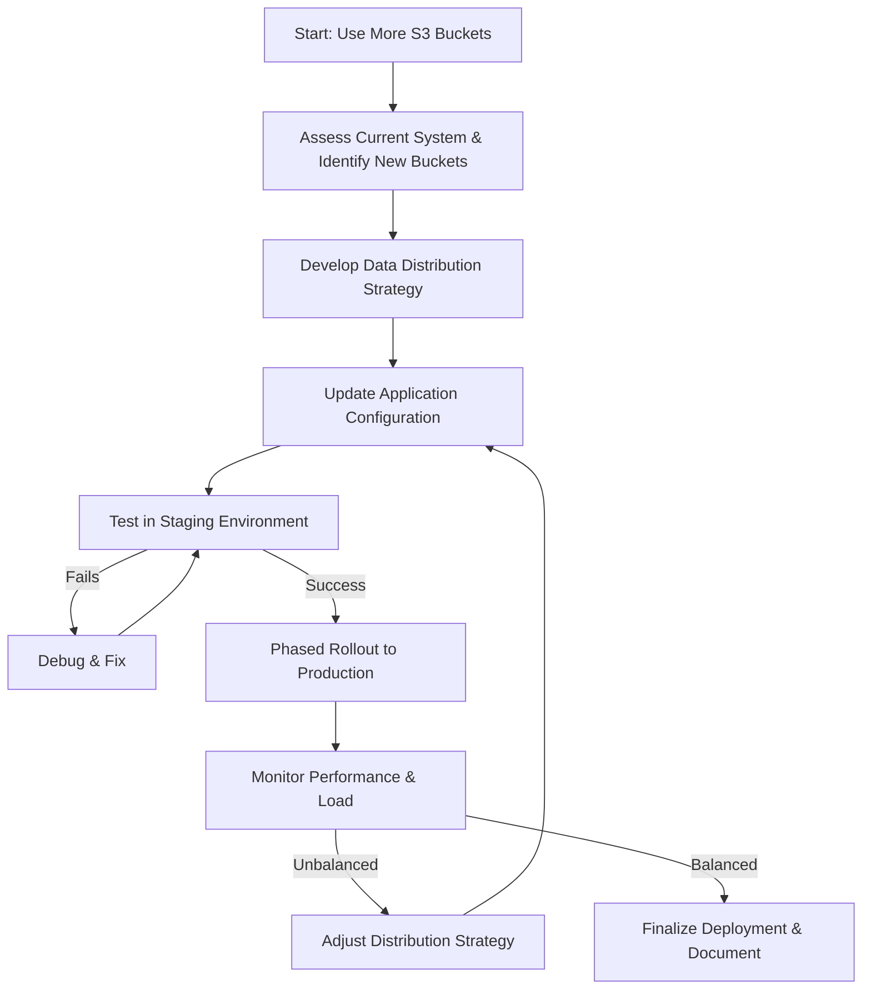

-----

# Ticket: We would like you to use more s3 buckets for distributing load

**Problem ID:** P3-010

### 1\. Problem Description

The current data ingestion pipeline is using a limited number of S3 buckets, leading to potential performance bottlenecks and uneven load distribution. The request is to distribute the load across a larger number of S3 buckets to improve parallelism, scalability, and overall performance.

### 2\. Implementation Workflow

This is a proactive change to improve system architecture. The workflow focuses on careful planning, phased implementation, and validation to ensure a smooth transition.

### 3\. Detailed Implementation Plan

#### Step 1: Planning and Strategy

1.  **Assess Current State:** Analyze the current load on the existing S3 buckets to understand the bottleneck.
2.  **Define a Distribution Strategy:** Decide on a logic for distributing data across the new buckets. Common strategies include:
      * **Hash-based:** Use a hash of a unique identifier (e.g., customer ID, log source ID) to assign data to a bucket.
      * **Time-based:** Assign data from specific time periods to different buckets.
      * **Service-based:** Create dedicated buckets for different services or applications.
3.  **Create New Buckets:** Create the necessary S3 buckets in the appropriate region, ensuring they have the correct permissions and policies.

#### Step 2: Configuration and Deployment

1.  **Update Application Logic:** Modify the application or data pipeline that writes to S3. Implement the chosen distribution strategy (e.g., add a function to calculate the destination bucket based on the data).
2.  **Configuration Update:** Update the application's configuration file to include the list of new S3 bucket names.
3.  **Deploy to Staging:** Deploy the updated code and configuration to a non-production (staging) environment.

#### Step 3: Testing and Validation

1.  **Ingestion Testing:** Run a data ingestion test in the staging environment.
2.  **Load Verification:** Use S3 metrics or a script to verify that the load is being distributed evenly across the new buckets as per the defined strategy.
3.  **Performance Benchmarking:** Measure the performance improvement in the staging environment and compare it to the baseline.
4.  **Final Deployment:** Once testing is successful, deploy the changes to the production environment using a controlled, phased rollout.

#### Step 4: Monitoring and Maintenance

1.  **Monitor S3 Metrics:** Continuously monitor S3 metrics (e.g., request count, data transfer) for all involved buckets to ensure the load remains balanced.
2.  **Monitor Application Logs:** Watch for any new errors related to S3 access or data writes.
3.  **Documentation:** Update the system documentation to reflect the new S3 bucket architecture and the data distribution strategy.

### 5\. Conclusion

This change will enhance the system's scalability and prevent a single point of failure in our S3 storage. The key to a successful implementation is a well-thought-out distribution strategy and thorough testing in a staging environment before the production rollout.
