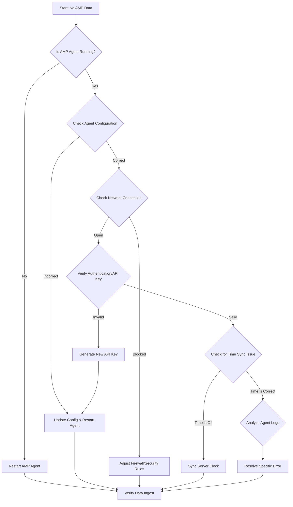

-----

# Ticket: No AMP data available anymore since 2nd September 03:40

**Problem ID:** P3-002

### 1\. Problem Description

Since 03:40 on September 2nd, the Application Performance Management (AMP) system has not received any new data. This is preventing us from monitoring the health and performance of our applications.

### 2\. Possible Root Causes

  * **Agent Crash/Stop:** The AMP agent on the application server has stopped running.
  * **Connectivity Issue:** The network connection between the AMP agent and the AMP server is broken or unstable.
  * **Authentication/API Key:** The API key or credentials used by the agent have expired or been revoked.
  * **Time Synchronization:** The date and time on the application server are incorrect, causing data from the past to be rejected.
  * **Configuration Change:** A recent change to the agent's configuration file or the application's environment variables has caused a data pipeline failure.

### 3\. Troubleshooting Workflow

The following diagram outlines the logical steps to diagnose and resolve this issue.

### 4\. Detailed Solution Steps

#### Solution 1: Check Agent Status and Service Health

1.  **Check Agent Status:** Log into the application server and verify if the AMP agent service is running.
      * **For Linux:** `sudo systemctl status <amp_agent_service>`
      * **For Windows:** Use the Services Manager (`services.msc`) to check the status.
2.  **Restart Agent:** If the agent is inactive, restart the service. This can often resolve temporary glitches.
      * `sudo systemctl restart <amp_agent_service>`

#### Solution 2: Verify Configuration and Credentials

1.  **Inspect Configuration:** Review the AMP agent's configuration file.
      * Ensure the **server URL** and **port** are correct.
      * Check for any typos or syntax errors.
2.  **Validate API Key/Credentials:** Confirm that the API key or any other authentication credentials being used are still valid and have not been reset or expired.

#### Solution 3: Troubleshoot Network and Time Synchronization

1.  **Test Connectivity:** Use `ping` or `telnet` to check if the application server can reach the AMP server.
      * `telnet <amp_server_ip> <port>`
2.  **Check Firewall:** Ensure that no firewall rules are blocking the traffic on the specific port used by the AMP agent.
3.  **Synchronize System Clock:** Incorrect system time can cause AMP servers to reject incoming data. Verify and, if needed, synchronize the server's clock.
      * `timedatectl` (for Linux)
      * Ensure the time and date match the monitoring system.

#### Solution 4: Analyze Agent Logs

1.  **Examine Logs:** Check the AMP agent's internal log files for any error messages.
      * Look for logs indicating a connection failure, authentication issue, or data parsing error.
      * The log file path is often specified in the agent's configuration file.

### 5\. Conclusion

By following these steps, you can pinpoint the exact cause of the data outage. The most common culprits are a stopped agent or a network block. If the issue persists after all steps, you may need to escalate the ticket to the team responsible for the AMP server itself to check its health and data ingestion pipeline.
