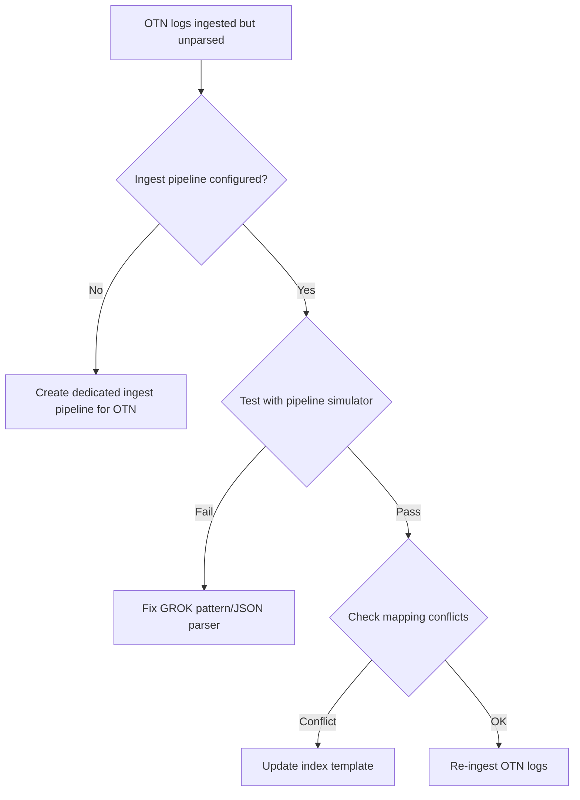

# Ticket: Elastic Parsing of Lodo OTN


### 1. Problem Description
Elastic is ingesting Lodo OTN logs but fields are not parsed correctly, leading to incomplete data in Kibana.

### 2. Possible Root Causes
- Ingest pipeline missing for OTN index.
- Mapping conflicts due to multiple data types.
- Wrong log pattern (format not aligned).
- Parsing dropped due to pipeline failure.

### 3. Troubleshooting Workflow


### 4. Detailed Solution Steps

#### Solution 1: Create Ingest Pipeline
```json
PUT _ingest/pipeline/otn_pipeline
{
  "description": "Parse OTN logs",
  "processors": [
    { "grok": { "field": "message", "patterns": ["%{TIMESTAMP_ISO8601:timestamp} %{WORD:component} %{LOGLEVEL:level} %{GREEDYDATA:msg}"] } }
  ]
}
```

#### Solution 2: Assign Pipeline
- Attach pipeline to index template:
  ```json
  PUT _template/otn_template
  {
    "index_patterns": ["logs-otn-*"],
    "settings": { "index.default_pipeline": "otn_pipeline" }
  }
  ```

#### Solution 3: Validate
- Ingest test log with `simulate` API.
- Check parsed fields in Kibana Discover.

### 5. Conclusion
Dedicated **OTN ingest pipeline** ensures correct parsing. With proper GROK and mappings, logs are fully usable in Kibana.
