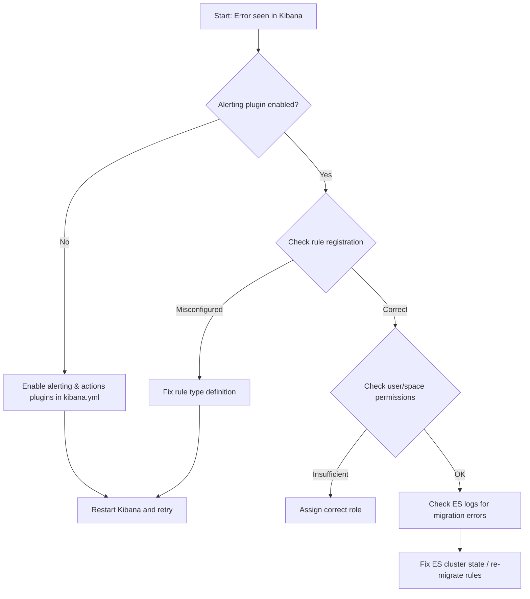

# Ticket: Rules Error - "Expected alertsClient not to be null"

**Problem ID:** P3-014  

### 1. Problem Description
Alerting rules in Kibana are failing with the error:  
`Expected alertsClient not to be null`.  
This prevents rules from executing and alert notifications from being triggered.

### 2. Possible Root Causes
- **Alerting Plugin Disabled:** Kibana alerting and actions plugins are not enabled in `kibana.yml`.
- **Incorrect Rule Registration:** Rule type not registered or improperly configured.
- **Spaces/Security Context:** Rule is created in a space where alerting is not enabled.
- **Cluster Upgrade Issue:** After upgrade, rules not re-migrated correctly.

### 3. Troubleshooting Workflow


### 4. Detailed Solution Steps

#### Solution 1: Enable Plugins
- Edit `kibana.yml` and ensure:
  ```yaml
  xpack.alerting.enabled: true
  xpack.actions.enabled: true
  ```
- Restart Kibana.

#### Solution 2: Re-register Rules
- Check the rule type registration in custom plugin:
  ```js
  alerting.registerType({ id: 'myRuleType', executor, ... });
  ```

#### Solution 3: Permissions
- Verify the user creating rules has `All` access for:
  - **Kibana → Stack Management → Alerting & Actions**
- Assign correct role if missing.

#### Solution 4: Migration Fix
- Check Elasticsearch logs for migration issues:
  ```bash
  GET .kibana_task_manager/_search?q=alert
  ```
- Delete broken tasks and re-import rules.

### 5. Conclusion
Most common cause is **alerting plugin disabled**. Once enabled and Kibana restarted, error disappears.
