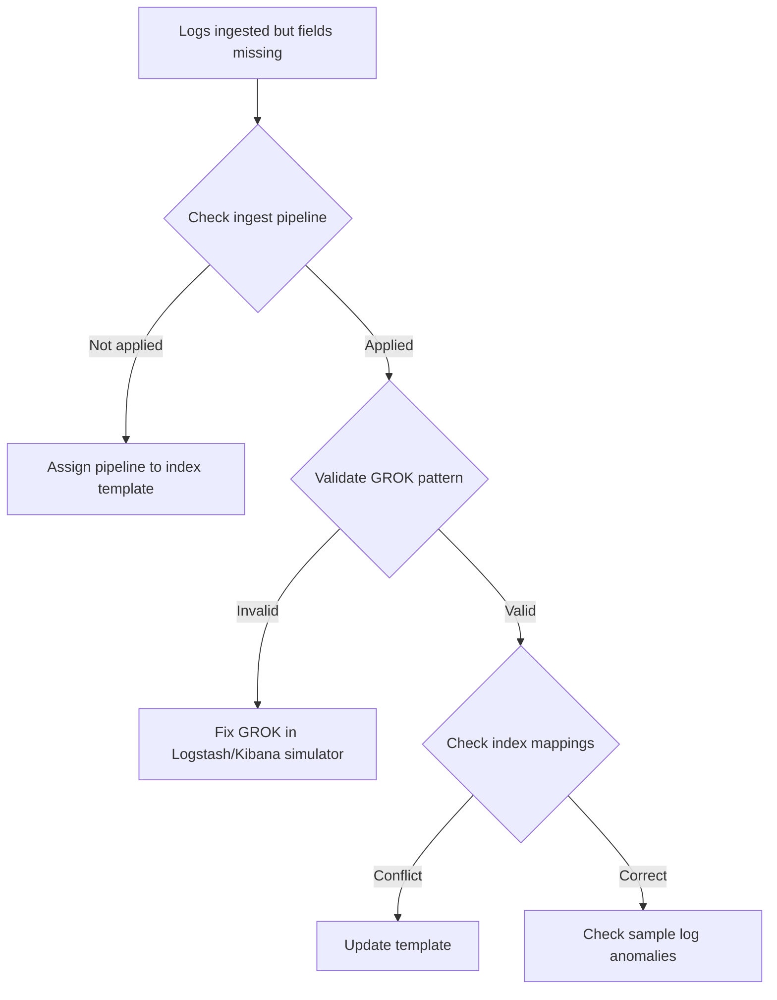

# Ticket: Parsing for Lodo JAM not going correctly

**Problem ID:** P3-015  

### 1. Problem Description
Logs from **Lodo JAM** are being ingested but parsing is failing. Fields are not correctly extracted in Kibana.

### 2. Possible Root Causes
- GROK pattern mismatch in Logstash pipeline.
- Wrong field mappings in index template.
- Unexpected log format (special characters, multi-line logs).
- Ingest pipeline not applied to index.

### 3. Troubleshooting Workflow


### 4. Detailed Solution Steps

#### Solution 1: Test GROK
- Use Kibana GROK debugger:
  ```logstash
  %{TIMESTAMP_ISO8601:timestamp} %{LOGLEVEL:level} %{GREEDYDATA:message}
  ```

#### Solution 2: Update Index Template
- Ensure `timestamp` is mapped as `date`, `level` as `keyword`.

#### Solution 3: Re-ingest Logs
- Replay sample logs through Logstash after fixing parsing.

### 5. Conclusion
Root cause is almost always **wrong GROK pattern**. Validating with debugger fixes parsing issues quickly.
