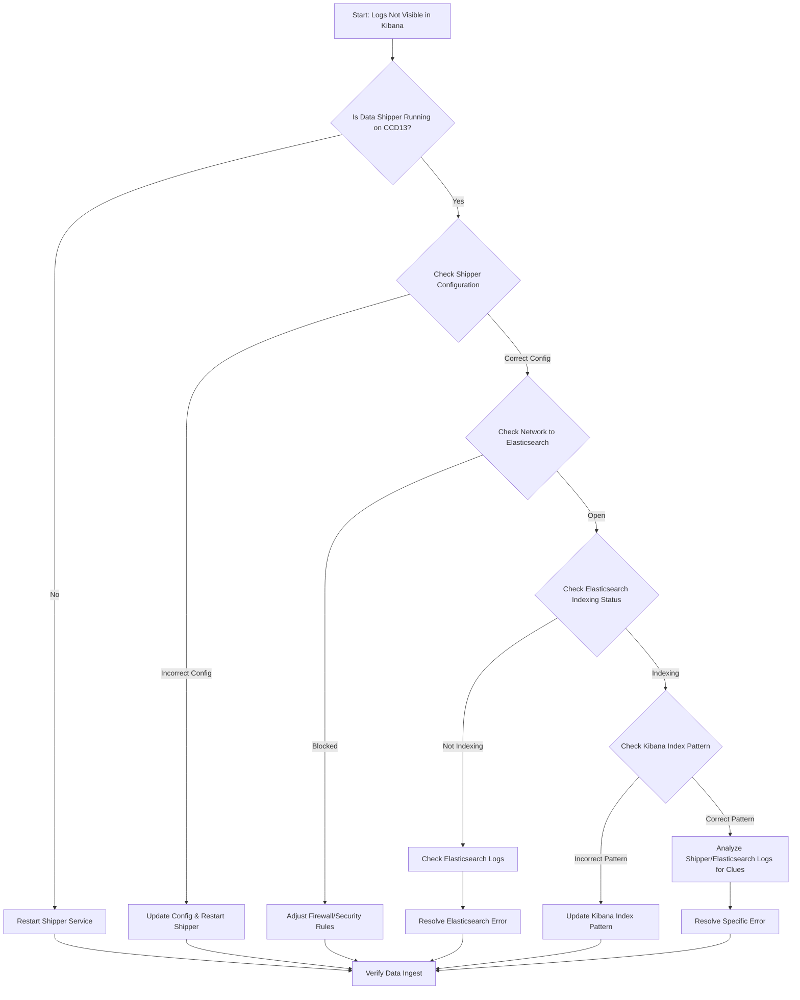

-----

# Ticket: CCD13 clusters log events not visible in Kibana

**Problem ID:** P3-003

### 1\. Problem Description

Log events from the `CCD13` clusters are not being displayed in Kibana, preventing us from visualizing and analyzing critical log data from these systems.

### 2\. Possible Root Causes

  * **Ingestion Pipeline Failure:** The data shipper (e.g., Logstash, Filebeat) on the `CCD13` cluster is not sending data to Elasticsearch.
  * **Elasticsearch Indexing Issue:** Elasticsearch is not correctly receiving or indexing the data from the cluster.
  * **Kibana Index Pattern:** The index pattern in Kibana is incorrect or does not match the incoming data stream.
  * **Network Connectivity:** A network issue is blocking the data from reaching the Elasticsearch cluster.
  * **Data Format/Parsing:** The logs are being sent, but their format is not being parsed correctly by the ingest pipeline in Elasticsearch, leading to no visible documents.

### 3\. Troubleshooting Workflow

The following diagram outlines the logical steps to diagnose and resolve this issue.



### 4\. Detailed Solution Steps

#### Solution 1: Verify the Data Shipper on CCD13

1.  **Check Service Status:** Log into a server in the `CCD13` cluster and verify that the data shipper (e.g., Filebeat or Logstash) is running.
      * ```bash
          sudo systemctl status <shipper_service_name>
        ```
2.  **Inspect Configuration:** Review the shipper's configuration file to ensure the output destination (Elasticsearch host and port) and the input log paths are correct.
      * Check for any typos in the configuration.

#### Solution 2: Troubleshoot Network Connectivity

1.  **Test Connectivity:** From a server in the `CCD13` cluster, test the network connection to the Elasticsearch cluster.
      * ```bash
          telnet <elasticsearch_ip> <port>
        ```
      * If `telnet` fails, it confirms a network issue.
2.  **Check Firewall Rules:** Ensure that firewalls or security groups are not blocking traffic from the `CCD13` cluster to the Elasticsearch cluster.

#### Solution 3: Verify Elasticsearch and Kibana

1.  **Check Elasticsearch Health:** Use the Elasticsearch API to check the health and status of the cluster and its indices.

      * ```bash
          curl -X GET "http://<elasticsearch_ip>:9200/_cat/indices?v"
        ```
      * Look for the index that should be receiving the `CCD13` data (e.g., `logs-ccd13-*`). Check its document count to see if it's increasing.

2.  **Validate Kibana Index Pattern:** In Kibana, go to "Stack Management" -\> "Index Patterns" and ensure that the index pattern for the `CCD13` data is correct and points to the right index.

      * For example, if your Elasticsearch index is `logs-ccd13-2025.09.30`, the index pattern should be `logs-ccd13-*`.
      * Refresh the index pattern field list to ensure it's up-to-date.

3.  **Search in Dev Tools:** Use the Kibana "Dev Tools" console to manually query Elasticsearch and see if the data exists.

      * ```json
          GET logs-ccd13-*/_search
          {
            "query": {
              "match_all": {}
            }
          }
        ```
      * If documents are returned, the issue is in the Kibana visualization itself. If not, the data is not reaching Elasticsearch.

### 5\. Conclusion

Start with the data shipper on the cluster, as it's the most common point of failure. If data is not reaching Elasticsearch, the problem is most likely a network or configuration issue. If data is in Elasticsearch but not in Kibana, the problem is within the Kibana index pattern or visualization settings.