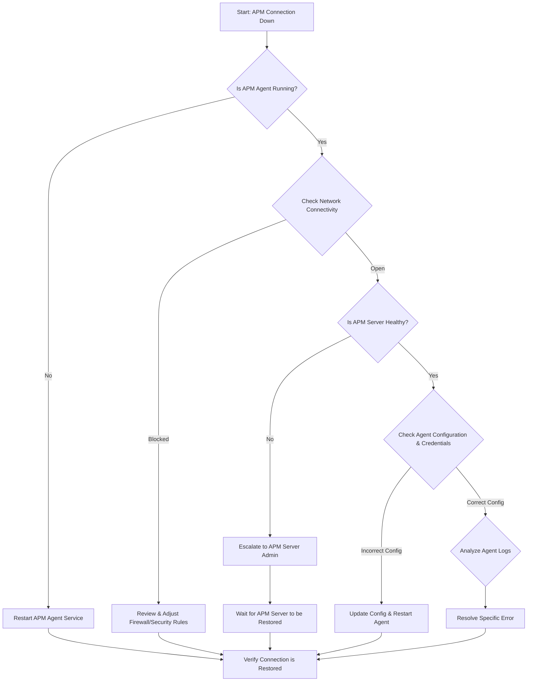

-----

# Ticket: Connection to APM down

**Problem ID:** P3-004

### 1\. Problem Description

The connection to the Application Performance Management (APM) server is down. This prevents the collection of critical application performance metrics, impacting our ability to monitor application health and diagnose performance issues.

### 2\. Possible Root Causes

  * **APM Agent Failure:** The APM agent running on the application host has stopped or crashed.
  * **Network Connectivity:** A network issue, such as a firewall, security group rule, or routing problem, is blocking the agent from communicating with the APM server.
  * **APM Server Downtime:** The APM server itself is offline or experiencing issues.
  * **Authentication/API Key:** The API key or credentials used by the agent are incorrect, expired, or have been revoked.
  * **Time Drift:** A significant difference in time between the agent and the server is causing communication to fail.

### 3\. Troubleshooting Workflow

The following diagram outlines the logical steps to diagnose and resolve this issue.



### 4\. Detailed Solution Steps

#### Solution 1: Verify APM Agent Status

1.  **Check Service Status:** Log into the application server and check the status of the APM agent service.
      * **For `systemd` services:**
        ```bash
        sudo systemctl status <apm_agent_name>
        ```
2.  **Restart Agent:** If the service is not running, restart it to see if this resolves the issue.
      * ```bash
          sudo systemctl restart <apm_agent_name>
        ```

#### Solution 2: Troubleshoot Network Connectivity

1.  **Test Connection:** Use `telnet` or `curl` to check if the application server can connect to the APM server's host and port.

      * ```bash
          telnet <apm_server_ip> <port>
        ```
      * If this command fails to connect, it indicates a network block.

2.  **Inspect Firewall Rules:**

      * On the application host, check the local firewall (`ufw`, `iptables`).
      * In your cloud environment, review the **Security Groups** or **NACLs** to ensure outbound traffic to the APM server is allowed on the correct port.

#### Solution 3: Check APM Server and Authentication

1.  **Verify APM Server Health:** Check the APM server's status page or API endpoint to ensure it is operational and accepting connections.
      * This may require internal monitoring tools or communication with the APM team.
2.  **Validate Credentials:** Look in the APM agent's configuration file for the API key, secret token, or any other credentials.
      * Cross-reference these credentials with the APM server's configuration to ensure they are valid and haven't been rotated.

#### Solution 4: Analyze Agent Logs

1.  **Examine Log Files:** Check the APM agent's logs for any error messages.
      * The logs might indicate a specific reason for the connection failure, such as `Authentication Failed`, `Connection Timed Out`, or `Server Not Found`.
2.  **Check Time Synchronization:** A large time difference between the agent and the server can cause certificate validation failures. Verify that both systems have their clocks synchronized (e.g., using an NTP server).

### 5\. Conclusion

Start by checking the APM agent's status and network connectivity. The majority of APM connection issues are resolved at this level. If the agent is running and the network is open, the problem is likely on the APM server side or related to a configuration/authentication mismatch.