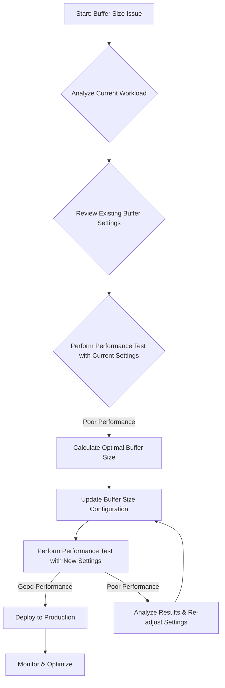

-----

# Ticket: Current buffer size settings s3 repositories

**Problem ID:** P3-009

### 1\. Problem Description

The current buffer size settings for our S3 repositories are causing performance issues, specifically with high-volume data ingestion. This is leading to slow data backups, increased I/O operations, or unexpected job failures.

### 2\. Possible Root Causes

  * **Inefficient Data Chunks:** The buffer size is too small, leading to an excessive number of small data chunks being uploaded, which increases API call overhead.
  * **Memory Constraints:** The buffer size is set too large, consuming too much memory on the host and causing performance degradation or crashes.
  * **Network Latency:** The buffer size is not optimized for the network latency between the host and the S3 bucket, leading to inefficient data transfer.
  * **Incorrect Default Settings:** The system is using a default buffer size that is not suitable for our specific workload.

### 3\. Troubleshooting Workflow

The following diagram outlines the logical steps to diagnose and resolve this issue.

### 4\. Detailed Solution Steps

#### Solution 1: Analyze Workload and Review Current Settings

1.  **Analyze Data Volume:** Determine the typical size of the data being uploaded to S3 and the rate of data ingestion.
2.  **Review Current Configuration:** Locate the configuration file where the S3 buffer size is defined. This could be in an application's `.conf` file, a database setting (e.g., Elasticsearch repository settings), or a cloud-specific configuration.
3.  **Check Defaults:** Understand the default buffer size provided by the application to determine if it has been customized.

#### Solution 2: Perform Performance Testing and Optimization

1.  **Establish a Baseline:** Run a controlled performance test with the current buffer size settings and measure key metrics like upload time, CPU usage, and memory consumption.
2.  **Calculate Optimal Size:** The optimal buffer size is a balance between I/O efficiency and memory usage.
      * **Rule of Thumb:** A larger buffer size reduces API calls and network overhead. However, it requires more memory. A good starting point is often between 5MB and 20MB.
      * **Consider Network:** For high-latency networks, a larger buffer size can be more efficient.
3.  **Update Configuration:** Change the buffer size value in the configuration file. For example, in an Elasticsearch S3 repository, you might update the `chunk_size` setting.
4.  **Test New Settings:** Rerun the same performance test with the new buffer size. Compare the results against the baseline.
5.  **Iterate and Refine:** If the performance is still not optimal, adjust the buffer size again based on the test results. Look for a sweet spot where upload time is minimized without causing excessive resource usage.

### 5\. Conclusion

The solution to a buffer size issue is an iterative process of testing and tuning. By first establishing a baseline and then experimenting with a larger or smaller buffer size, you can find the optimal setting for your specific data and environment. The goal is to minimize API calls and overhead while keeping resource consumption at an acceptable level.