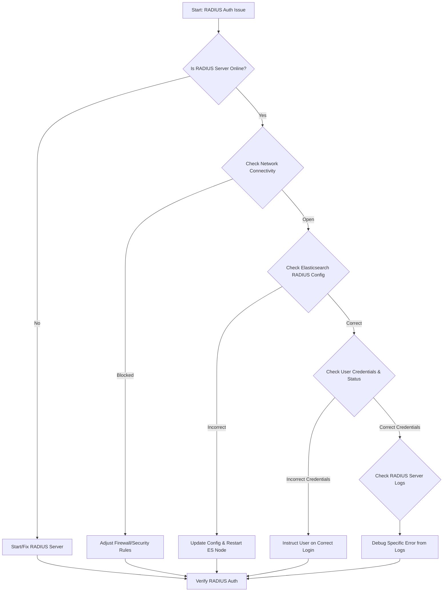

-----

# Ticket: Elastic/Kibana Arrange RADIUS account issue

**Problem ID:** P3-013

### 1\. Problem Description

Users are facing issues with authentication to Elastic and Kibana using their RADIUS accounts. This is preventing them from accessing dashboards, logs, and other critical data. The problem might be related to a misconfiguration or a recent change in the authentication setup.

### 2\. Possible Root Causes

  * **Incorrect RADIUS Configuration:** The `radius` realm in Elasticsearch is misconfigured (e.g., wrong IP address, shared secret, or port).
  * **RADIUS Server Downtime:** The RADIUS server itself is offline or not responding to authentication requests.
  * **Network Connectivity:** A firewall or network ACL is blocking communication between the Elasticsearch cluster and the RADIUS server.
  * **Account Lockout/Credentials:** The user's RADIUS account has expired, been locked out, or the user is entering incorrect credentials.
  * **Certificate Issues:** If using secure communication (TLS/SSL), the certificates are expired or invalid.

### 3\. Troubleshooting Workflow

The following diagram outlines the logical steps to diagnose and resolve this issue.



### 4\. Detailed Solution Steps

#### Solution 1: Verify RADIUS Server and Network

1.  **Check RADIUS Server Status:** Ensure the RADIUS server is online and running. Use a local command-line tool on the server itself to verify its service status.
2.  **Test Network Connectivity:** From an Elasticsearch host, use `telnet` to check if you can connect to the RADIUS server's authentication port (typically 1812).
      * ```bash
          telnet <radius_server_ip> 1812
        ```
      * If this fails, investigate network routes and firewalls.

#### Solution 2: Inspect Elasticsearch Configuration

1.  **Review `elasticsearch.yml`:** Log in to an Elasticsearch node and examine the `elasticsearch.yml` configuration file.
      * Find the `xpack.security.authc.realms.radius.radius1` realm configuration block.
      * Ensure the `hostname`, `port`, and `shared_secret` are all correct and match the settings on the RADIUS server.
2.  **Verify Certificate Paths:** If you are using TLS/SSL, confirm that the certificate and key file paths in the `xpack` configuration are correct and that the certificates are not expired.
3.  **Restart Nodes:** If you make any changes to `elasticsearch.yml`, you must restart the Elasticsearch node for the changes to take effect.

#### Solution 3: Check User Accounts and Logs

1.  **Verify User Credentials:** Instruct the user to re-enter their credentials carefully. Sometimes, a simple typo is the cause.
2.  **Check RADIUS Server Logs:** This is a crucial step. The RADIUS server's log files will show whether it is receiving the authentication request from Elasticsearch and, most importantly, *why* it is failing.
      * Look for log entries related to the user's login attempt. The logs may indicate an invalid password, a locked account, or a failed policy check.
3.  **Analyze Elasticsearch Logs:** Check the Elasticsearch logs on the node that's handling the authentication request. They may provide details on why the connection to the RADIUS server is failing (e.g., `Connection refused`, `Authentication Failed`).

### 5\. Conclusion

RADIUS authentication issues are most commonly a result of a misconfigured shared secret or a network blockage between the two systems. The best approach is to verify network connectivity first, then check the configurations on both the Elasticsearch and RADIUS servers, and finally, use the logs to pinpoint the exact reason for the failure.