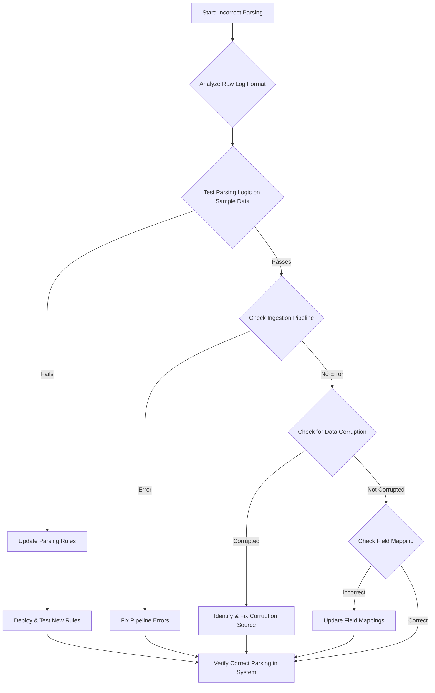

-----

# Ticket: Incorrect parsing noticed for lodo OTN

**Problem ID:** P3-006

### 1\. Problem Description

Logs from the `lodo OTN` source are being ingested, but the parsing is incorrect. This means key data fields are not being extracted, and the logs are not searchable or usable in our analytics platform (e.g., Kibana).

### 2\. Possible Root Causes

  * **Schema Drift:** The format of the `lodo OTN` logs has changed, and the existing parsing logic is now outdated.
  * **Incorrect Grok Pattern:** The Grok pattern being used to parse the logs has a syntax error or does not accurately match the log lines.
  * **Parsing Logic Error:** The ingest pipeline (e.g., in Logstash or Elasticsearch) has an error in its parsing logic.
  * **Data Ingestion Corruption:** The data is being corrupted during the ingestion process, making it impossible to parse correctly.
  * **Typo in Field Mapping:** The parsed fields are not being mapped correctly to the destination index.

### 3\. Troubleshooting Workflow

The following diagram outlines the logical steps to diagnose and resolve this issue.

### 4\. Detailed Solution Steps

#### Solution 1: Analyze Raw Logs and Test Parsing Logic

1.  **Examine Raw Logs:** Find a raw log example from the `lodo OTN` source. Compare it to the expected format. Look for new fields, changed separators, or new data structures.
2.  **Use a Parsing Tester:** Use a tool (like a Grok Debugger or an online parser) to test the current parsing logic with a sample of the raw log data.
      * This will immediately show if the parsing logic is flawed and what specific fields are failing to parse.
3.  **Update Parsing Rules:** If the test fails, update the Grok pattern, JSON filter, or other parsing rules to correctly extract the necessary fields.

#### Solution 2: Verify the Ingestion Pipeline

1.  **Check Ingestion Pipeline Logs:** Examine the logs of the service responsible for parsing (e.g., Logstash, Filebeat with ingest pipelines).
      * Look for error messages like "failed to parse," "grok error," or "invalid field." These logs will often point to the exact line or pattern that is failing.
2.  **Validate Pipeline Configuration:** If the logs are not helpful, review the entire ingest pipeline configuration file to ensure all components are configured correctly.

#### Solution 3: Address Field Mapping and Data Integrity

1.  **Check Field Mappings:** In the destination system (e.g., Elasticsearch), check the index's field mappings.
      * An incorrect mapping (e.g., a number field being treated as a string) can cause parsing to fail.
      * Use the API: `GET <your_index_name>/_mapping`
2.  **Investigate Data Corruption:** If the parsing logic and configuration are correct, there might be data corruption. This can happen due to network issues or bugs in the log shipping agent.
      * Check if the data is arriving at the ingestion service in its raw, correct format.

### 5\. Conclusion

The most common reason for parsing errors is a change in the log source's format. The quickest solution is to get a sample of the raw log, test the parsing logic in a debugger, and update the configuration accordingly. If that doesn't work, the error is likely a configuration issue in the ingestion pipeline or a problem with data integrity.