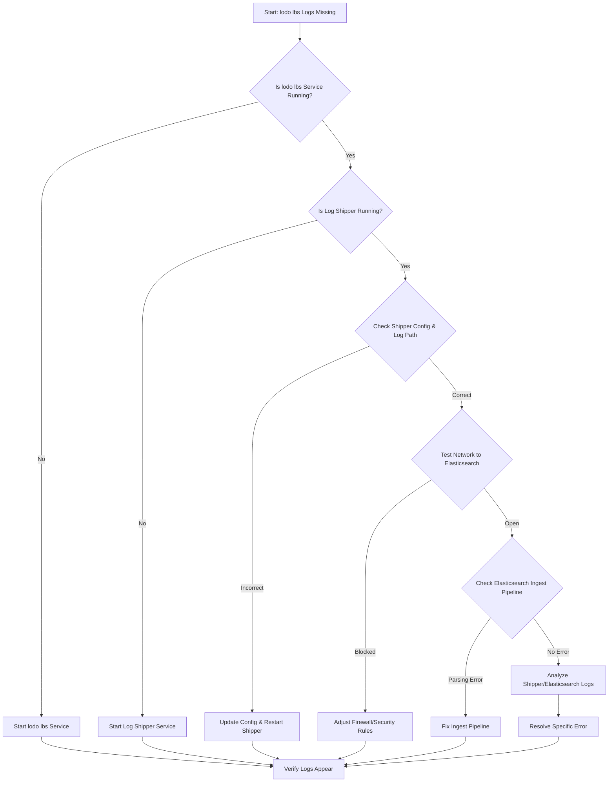

-----

# Ticket: Logging for lodo lbs is not being seen in Elastic

**Problem ID:** P3-012

### 1\. Problem Description

Log data from the "lodo lbs" service is not appearing in our Elastic Stack (Elasticsearch and Kibana). This prevents us from monitoring the health and activity of the load balancer service and troubleshooting any potential issues.

### 2\. Possible Root Causes

  * **Log Shipper Failure:** The log collection agent (e.g., Filebeat, Logstash) on the "lodo lbs" host is not running.
  * **Incorrect Configuration:** The shipper's configuration file contains an error, such as an invalid log file path, a wrong output host, or an incorrect port.
  * **Network Blockage:** A firewall or security group rule is preventing the logs from being sent to the Elasticsearch cluster.
  * **Service Downtime:** The "lodo lbs" service itself is not running and, as a result, is not generating any log files.
  * **Parsing Failure:** The logs are being sent, but they are not being correctly parsed by the ingest pipeline in Elasticsearch, leading to no searchable data.

### 3\. Troubleshooting Workflow

The following diagram outlines the logical steps to diagnose and resolve this issue.



### 4\. Detailed Solution Steps

#### Solution 1: Verify Service and Log Shipper Status

1.  **Check "lodo lbs" Service:** First, confirm that the "lodo lbs" service is running and actively generating logs. You can check the service status on its host.
2.  **Check Log Shipper:** Log in to the server hosting the "lodo lbs" service and verify that the log shipper agent (e.g., Filebeat) is running.
      * ```bash
          sudo systemctl status <shipper_service_name>
        ```
3.  **Restart Shipper:** If the log shipper is not running, start it and check if logs begin to appear in Kibana.

#### Solution 2: Inspect Log Shipper Configuration

1.  **Review Configuration File:** Open the shipper's configuration file (e.g., `filebeat.yml`).
2.  **Verify Log Path:** Confirm that the `input` section correctly points to the log file path for the "lodo lbs" service.
3.  **Validate Output:** Ensure the `output` section correctly points to the Elasticsearch cluster's host and port.

#### Solution 3: Troubleshoot Network and Firewall

1.  **Test Network Connectivity:** From the "lodo lbs" server, use `telnet` or `ping` to verify that you can connect to the Elasticsearch cluster on the correct port.
      * ```bash
          telnet <elastic_host_ip> <port>
        ```
2.  **Check Firewall:** Investigate local firewalls on the "lodo lbs" server and security groups on the Elasticsearch cluster to ensure that the necessary ports are open.

#### Solution 4: Investigate Parsing and Indexing

1.  **Check Ingest Pipeline:** If logs are reaching Elasticsearch but not appearing in Kibana, the problem could be a parsing error.
      * In Kibana's "Dev Tools," use the `_ingest/pipeline/_simulate` API to test a raw log line against the ingest pipeline to see where it fails.
2.  **Analyze Logs:** The most crucial step is to check the internal logs of the log shipper and Elasticsearch. These logs will provide specific error messages that can pinpoint the cause, such as a "parsing error," "connection timeout," or "document dropped" message.

### 5\. Conclusion

The most common reasons for this issue are a simple service failure on the log shipper or a misconfigured log path. If the shipper is running and configured correctly, the problem is likely a network issue or a parsing error in Elasticsearch. By following the workflow, you can quickly narrow down the root cause.