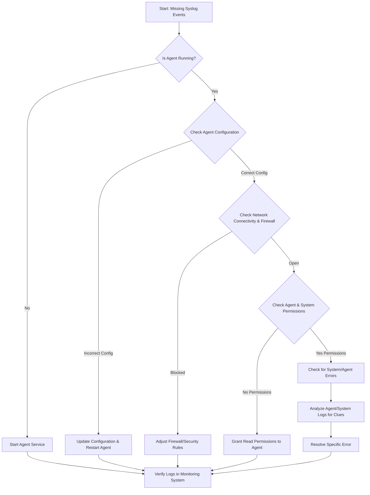

-----

# Ticket: Missing Linux Syslog Events

**Problem ID:** P3-001

### 1\. Problem Description

Syslog events from one or more Linux servers are not being collected by our centralized logging system (e.g., Elasticsearch, Splunk). This issue prevents effective system health monitoring, security analysis, and troubleshooting.

### 2\. Possible Root Causes

  * **Agent Failure:** The log collection agent (e.g., Filebeat, rsyslog) is not running on the server.
  * **Configuration Error:** The agent's configuration file has an incorrect output destination, log path, or other syntax errors.
  * **Network Block:** A firewall, security group, or network routing issue is preventing logs from reaching the logging system.
  * **Permission Issues:** The log agent does not have the necessary read permissions for the syslog files.
  * **Log Overload:** A very high volume of logs is overwhelming the agent or the network, causing a buffer overflow.

### 3\. Troubleshooting Workflow

The following diagram outlines the logical steps to diagnose and resolve this issue.



### 4\. Detailed Solution Steps

#### Solution 1: Verify Agent Status and Configuration

1.  **Check Agent Status:** Log into the Linux server via SSH and check the status of your log shipper.

      * **For `systemd` services:**
        ```bash
        sudo systemctl status <agent_name>
        ```
      * **If the agent is inactive, restart it:**
        ```bash
        sudo systemctl start <agent_name>
        ```

2.  **Inspect Configuration File:** Open the agent's configuration file to ensure the destination is correct.

      * For **Filebeat**: `sudo cat /etc/filebeat/filebeat.yml`
      * For **rsyslog**: `sudo cat /etc/rsyslog.conf`
      * Confirm the **output host and port** are correct and match the logging system's address.

#### Solution 2: Troubleshoot Network and Firewall

1.  **Test Connectivity:** Use a command-line tool to verify that the server can connect to the logging system's port.

      * ```bash
          telnet <log_system_ip> <port>
        ```
      * If `telnet` fails, it indicates a network block.

2.  **Check Firewall Rules:**

      * On the server, check the local firewall: `sudo ufw status` or `sudo iptables -L`.
      * In your cloud environment (e.g., AWS, Azure), verify that **Security Group** or **Network Access Control List (NACL)** rules allow outbound traffic on the required port (e.g., TCP 5044 for Filebeat).

#### Solution 3: Check Permissions and Analyze Logs

1.  **Verify File Permissions:** Ensure the log agent user has read permissions for the log files (`/var/log/syslog`, etc.).

      * ```bash
          ls -l /var/log/
        ```
      * Adjust permissions if necessary using `chown` or `chmod`.

2.  **Examine Agent's Internal Logs:** The agent itself often logs its activities and errors. Check these logs for clues.

      * ```bash
          sudo journalctl -u <agent_name> -f
        ```
      * Look for keywords like **"error," "failed to connect,"** or **"permission denied."**

### 5\. Conclusion

If all of these steps fail to resolve the issue, the problem might lie within the centralized logging system itself (e.g., an indexing issue on Elasticsearch or a parsing failure). At this point, you should investigate the logging system's internal health and logs.