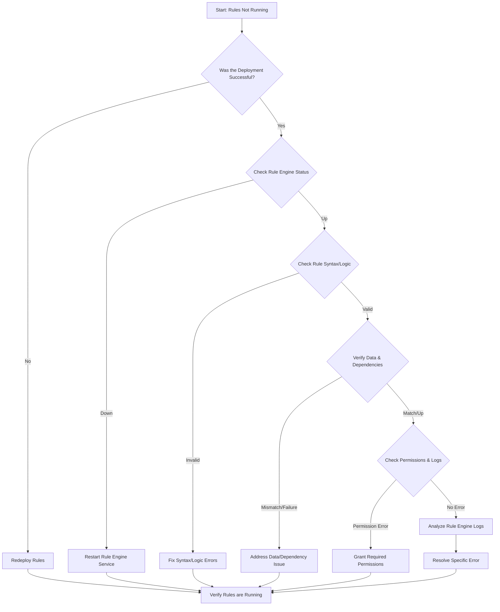

-----

# Ticket: My new rules are no more running

**Problem ID:** P3-005

### 1\. Problem Description

A set of recently deployed rules are no longer executing or are not producing the expected results. This is impacting automated processes, alerting, or data transformation pipelines.

### 2\. Possible Root Causes

  * **Deployment Failure:** The new rules were not deployed correctly, or an older version of the rules is still active.
  * **Syntax/Logic Error:** The rules themselves contain a syntax error or a logical flaw that prevents them from executing correctly.
  * **Dependent Service Failure:** A service that the rules depend on (e.g., a database, a message queue, or an API) is down or unreachable.
  * **Data Format Change:** The format of the incoming data has changed, and the rules are no longer able to parse or match the data.
  * **Permissions/Authentication:** The rule engine or the user account running the rules lacks the necessary permissions to access required resources.

### 3\. Troubleshooting Workflow

The following diagram outlines the logical steps to diagnose and resolve this issue.



### 4\. Detailed Solution Steps

#### Solution 1: Verify Deployment and Service Status

1.  **Confirm Successful Deployment:** Check the deployment logs or a version control system (like Git) to ensure the new rules were successfully deployed to the production environment. Roll back to a previous working version if necessary.
2.  **Check Rule Engine Service:** Ensure the service that executes the rules is running.
      * ```bash
          sudo systemctl status <rule_engine_service>
        ```
      * If the service is inactive, restart it: `sudo systemctl restart <rule_engine_service>`.

#### Solution 2: Inspect Rule Syntax and Logic

1.  **Validate Rules:** If possible, use a staging or development environment to test the rules with sample data.
2.  **Examine Syntax:** Carefully review the rule code for common errors like typos, incorrect field names, or improper syntax. Many rule engines have built-in syntax validators.
3.  **Test Logic:** Run the rules against a known dataset to verify that the logic is correct and produces the expected output.

#### Solution 3: Check Data and Dependencies

1.  **Verify Data Format:** The rules may be failing because the incoming data format has changed. Confirm that the data structure (e.g., JSON schema, CSV columns) matches what the rules expect.
2.  **Check Dependent Services:** Ensure all external services or data sources that the rules rely on (e.g., a database, API endpoint, or message queue) are operational and accessible.
3.  **Test Connectivity:** Use `curl` or `telnet` to check connectivity to dependent services.

#### Solution 4: Analyze Logs and Permissions

1.  **Examine Rule Engine Logs:** The most crucial step is to check the logs of the rule engine. Look for error messages that indicate why a rule failed to execute.
      * Log messages may point to a specific line in the rule code or a failed API call.
2.  **Check Permissions:** Ensure that the user account or service account running the rules has the necessary permissions to read from data sources and write to output destinations.

### 5\. Conclusion

The problem is most likely a simple deployment error or a logical bug in the new rules. By systematically checking the deployment status, the rule's syntax, and dependent services, you can quickly identify and fix the issue. The rule engine's logs are your most valuable tool for diagnosing the specific failure.