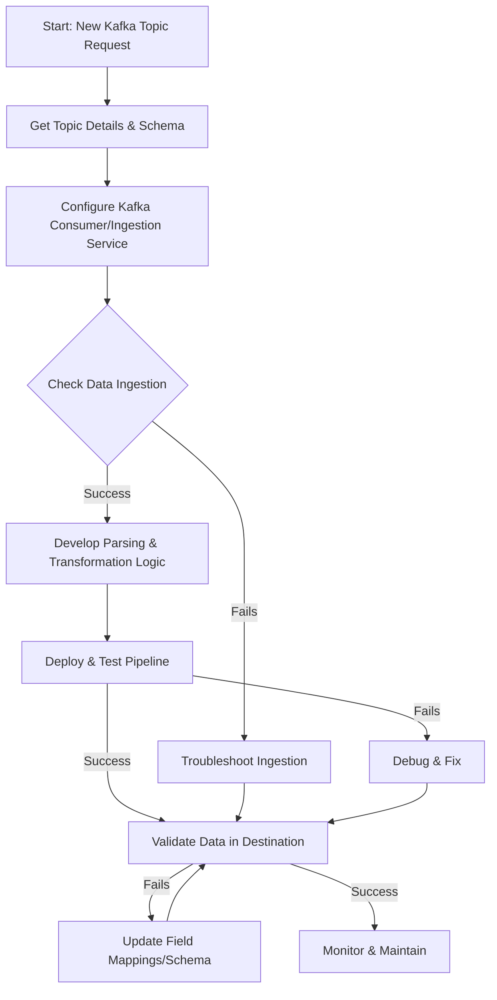

-----

# Ticket: New kafka topic to be processed

**Problem ID:** P3-007

### 1\. Problem Description

A new Kafka topic has been created and needs to be integrated into our data processing pipeline. The goal is to ingest, parse, and store the data from this topic in our destination system (e.g., Elasticsearch, S3, etc.).

### 2\. Required Steps and Workflow

This is a request for new work rather than a fix for a problem. The workflow involves a series of implementation and verification steps to ensure the new data pipeline is set up correctly.

### 3\. Detailed Implementation Plan

#### Step 1: Gather Requirements and Kafka Details

1.  **Get Topic Name:** Confirm the exact name of the new Kafka topic.
2.  **Understand Schema:** Get the data schema for the messages in the topic. This is crucial for building the correct parsing logic.
3.  **Identify Destination:** Determine where the data needs to be stored (e.g., which Elasticsearch index, S3 bucket, database table).

#### Step 2: Configure the Data Ingestion Service

1.  **Update Configuration:** Add a new input block to your ingestion service's configuration file (e.g., Logstash, Apache Flink, etc.) to listen to the new Kafka topic.
      * Specify the topic name, Kafka broker address, and any required security settings.
2.  **Deploy and Monitor:** Deploy the updated configuration and monitor the ingestion service's logs to ensure it can connect to the Kafka topic and start receiving data.

#### Step 3: Develop Parsing and Transformation Logic

1.  **Design Parsing Pipeline:** Based on the data schema, create the necessary parsing filters.
      * **For JSON data:** Use a `json` filter.
      * **For structured logs:** Use a `grok` or `dissect` filter.
2.  **Add Enrichment/Transformation:** If required, add filters to transform, enrich, or add metadata to the incoming data (e.g., adding a timestamp or a new field).

#### Step 4: Deploy, Test, and Validate

1.  **Staging Deployment:** Deploy the complete pipeline to a staging or testing environment first.
2.  **Data Validation:** Send sample messages to the new Kafka topic and verify that the data is correctly ingested, parsed, and stored in the destination.
3.  **Check Destination Schema:** Ensure the destination index or table has the correct field mappings to handle the new data types.
4.  **Final Deployment:** Once testing is successful, deploy the changes to the production environment.

#### Step 5: Ongoing Monitoring

1.  **Create Dashboards:** Build dashboards and visualizations in your analytics platform (e.g., Kibana) to monitor the incoming data stream.
2.  **Set Up Alerts:** Configure alerts to notify the team if data ingestion stops or if parsing errors occur.

-----