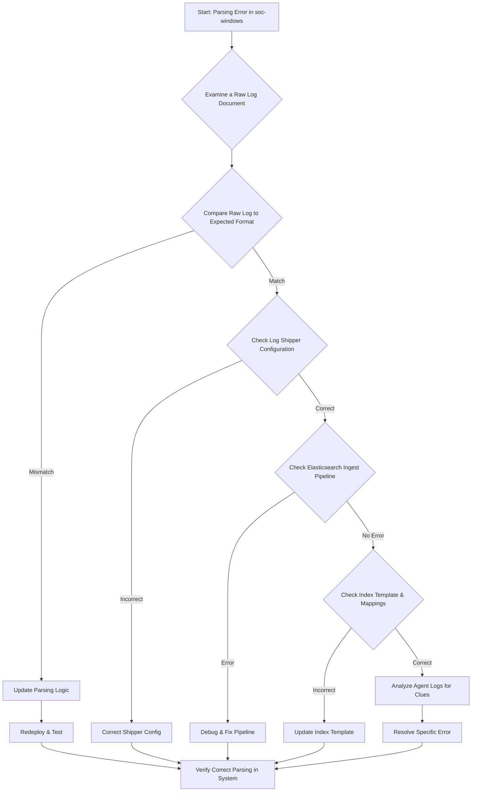

-----

# Ticket: Parsing error in the index soc-windows

**Problem ID:** P3-008

### 1\. Problem Description

Logs from Windows systems, which are being ingested into the `soc-windows` index, are not being parsed correctly. This results in key data fields (e.g., `event_id`, `user`, `hostname`) being unreadable, which severely impacts our security monitoring and analysis capabilities.

### 2\. Possible Root Causes

  * **Log Format Change:** A Windows update or a new application on the servers has changed the format of the event logs.
  * **Incorrect Log Shipper Configuration:** The log shipper (e.g., Winlogbeat) has been misconfigured to send a different log type to the `soc-windows` index.
  * **Ingest Pipeline Failure:** The ingest pipeline in Elasticsearch or the parsing logic in Logstash is outdated or contains an error.
  * **Template Mismatch:** The index template in Elasticsearch that defines the field mappings for the `soc-windows` index is incorrect.
  * **Data Corruption:** The logs are being corrupted in transit.

### 3\. Troubleshooting Workflow

The following diagram outlines the logical steps to diagnose and resolve this issue.



### 4\. Detailed Solution Steps

#### Solution 1: Analyze Raw Log Data and Ingestion Pipeline

1.  **Examine Raw Document:** Use Kibana's "Dev Tools" to find a raw document from the `soc-windows` index that is failing to parse.

    ```json
    GET soc-windows-*/_search
    {
      "query": {
        "query_string": {
          "query": "NOT _exists_:event.id"
        }
      },
      "size": 1
    }
    ```

    This query will help you find a document that is missing a key field.

2.  **Compare Formats:** Take the raw log from the document and compare it with the expected log format. Pay close attention to timestamps, field delimiters, and nested JSON structures.

3.  **Test Parsing Logic:** If your system uses a dedicated parsing service (like Logstash), test the raw log against your current filters. If using Elasticsearch ingest pipelines, you can use the `_ingest/pipeline/_simulate` API to test.

#### Solution 2: Verify Log Shipper Configuration

1.  **Check Shipper Configuration:** Log in to one of the Windows servers and review the configuration file of the log shipper (e.g., `winlogbeat.yml`).

      * Ensure the correct `event_logs` are being collected and that they are being sent to the correct destination.

2.  **Look for Duplicates:** Sometimes, multiple agents or configurations can send duplicate data, causing parsing conflicts. Check for any redundant log shippers.

#### Solution 3: Address Elasticsearch Configuration

1.  **Check Ingest Pipeline:** If your system uses an Elasticsearch ingest pipeline, go to **Stack Management \> Ingest Pipelines** in Kibana.

      * Review the pipeline steps to ensure the processors are configured correctly (e.g., `grok`, `json`, `date`).
      * Look for errors in the pipeline's logs.

2.  **Review Index Template:** An incorrect or outdated index template can cause parsing issues.

      * ```json
        GET _template/winlogbeat-template
        ```
      * Check that the field mappings are correct. The template might need to be updated to match the new log format.

### 5\. Conclusion

The most likely cause of this issue is a minor change in the log format that the current parsing logic can't handle. By first examining a raw, failed document, you can quickly identify the problem. The next steps involve updating the parsing filters or the index template to match the new format and then verifying that the data is being ingested correctly.