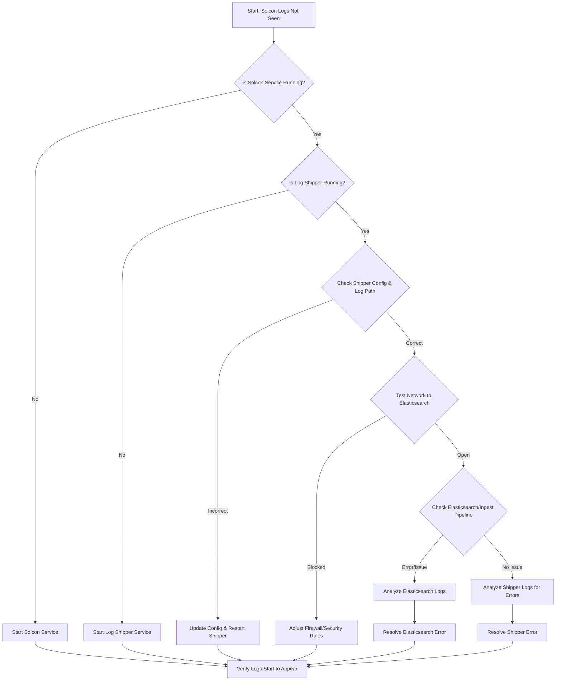

-----

# Ticket: Solcon logging is not being seen in Elastic

**Problem ID:** P3-011

### 1\. Problem Description

Log data from the "Solcon" service is not being ingested into our Elastic Stack (Elasticsearch and Kibana). This prevents us from monitoring the service's activity and diagnosing any issues that may arise.

### 2\. Possible Root Causes

  * **Log Shipper Failure:** The log shipper agent (e.g., Filebeat, Logstash) on the server running "Solcon" is either stopped or has crashed.
  * **Incorrect Configuration:** The shipper's configuration file is pointing to the wrong log file path, a non-existent host, or has an incorrect port.
  * **Network Connectivity:** Firewall rules or network routing issues are blocking the logs from reaching the Elasticsearch cluster.
  * **Elasticsearch Indexing Issue:** Elasticsearch is not correctly receiving the data or the index template is causing the data to be dropped.
  * **Service Downtime:** The "Solcon" service itself is not running, and therefore, it's not generating any logs.

### 3\. Troubleshooting Workflow

The following diagram outlines the logical steps to diagnose and resolve this issue.



### 4\. Detailed Solution Steps

#### Solution 1: Verify Service and Log Shipper Status

1.  **Check "Solcon" Service:** First, confirm that the "Solcon" service is operational and generating logs. You can check the service status on its host or look at its log file to see if new entries are being written.
2.  **Check Log Shipper:** Log in to the server hosting the "Solcon" service and verify that the log shipper agent (e.g., Filebeat, Logstash) is running.
      * ```bash
          sudo systemctl status <shipper_service_name>
        ```
3.  **Restart Shipper:** If the shipper is not running, restart it and check if logs start to appear in Elasticsearch.

#### Solution 2: Inspect Log Shipper Configuration

1.  **Review Config File:** Open the shipper's configuration file and verify that the `input` section is correctly pointing to the "Solcon" log file path.
      * For Filebeat, this would be in `filebeat.yml`. Ensure the `path` is correct and the file has not been renamed.
2.  **Verify Output Host:** Confirm that the `output` section of the configuration file is correctly pointing to the Elasticsearch cluster's host and port.

#### Solution 3: Troubleshoot Network and Firewall

1.  **Test Network Connectivity:** From the "Solcon" server, use `telnet` or `ping` to test the network connection to the Elasticsearch cluster on the correct port (usually 9200 for direct API or 5044 for Filebeat).
      * ```bash
          telnet <elastic_host_ip> <port>
        ```
2.  **Check Firewall Rules:** Look for firewall rules on both the "Solcon" host and the Elastic cluster's security groups that might be blocking the port used for logging.

#### Solution 4: Investigate Elasticsearch and Logs

1.  **Check Indexing Status:** In Kibana's "Dev Tools," check if a new index for "Solcon" logs has been created. Use the API to check for document counts.
      * ```bash
          GET _cat/indices/solcon*
        ```
2.  **Analyze Log Files:** The most valuable step is to check the internal logs of the log shipper. These logs will often contain specific error messages (e.g., "Connection refused," "Permission denied," "Failed to read file") that pinpoint the exact cause of the failure.

### 5\. Conclusion

The problem is most likely a stopped log shipper or a configuration issue related to the log file path or network. By systematically checking the service, agent, network, and logs, you can quickly identify and fix the issue.